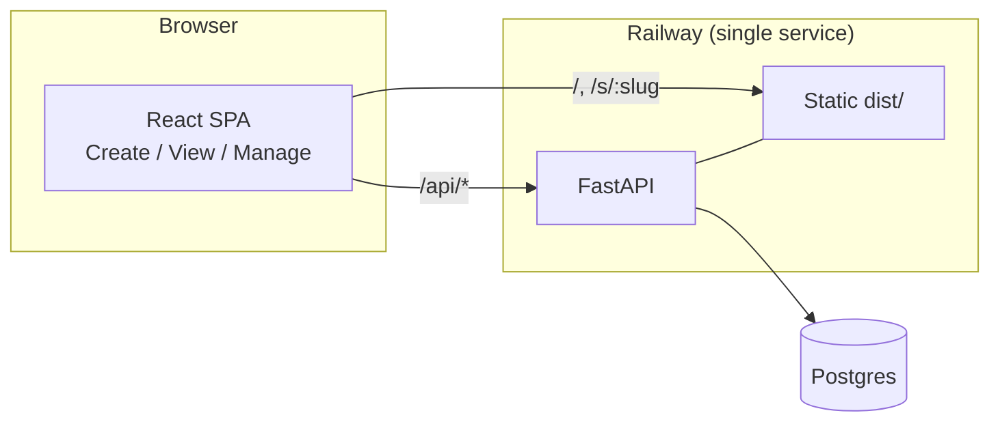

# ShareKnowledge

Paste markdown, get a shareable link. Anyone with the link sees a rendered,
sanitized preview. Optional password, expiry, edit, and delete — no accounts.

## Features

- 📝 Create a share from any markdown and get a public link.
- 👀 Rendered preview with **no raw HTML** + `rehype-sanitize` (XSS-safe).
- 🔒 Optional view password.
- ⏱️ Optional expiry (1h / 1d / 7d / 30d / never).
- ✏️ Edit and 🗑️ delete via a **manage token** shown once at creation.
- 🤖 A Claude Code skill (`share-knowledge`) to drive the API from the CLI.
- 🚦 Central per-IP rate limiting (slowapi) — tighter on create (spam) and unlock (brute-force).

## Architecture



One service serves the JSON API under `/api` and the built SPA for everything
else, so there is no CORS setup. Timestamps are stored as naive UTC. Edit/delete
are authorized by a hashed manage token; passwords are hashed with pbkdf2_sha256.

## Layout

```
backend/    FastAPI + SQLAlchemy (app/), pytest suite (tests/)
frontend/   Vite + TypeScript + React, vitest/RTL tests
skill/      share-knowledge Claude Code skill (stdlib CLI + tests)
Dockerfile  multi-stage build → single runtime image
railway.toml
```

## Local development

Backend (API on :8000):
```bash
cd backend
python3 -m venv .venv && ./.venv/bin/python -m pip install -r requirements-dev.txt
./.venv/bin/uvicorn app.main:app --reload      # defaults to a local SQLite file
```

Frontend (dev server on :5173, proxies /api → :8000):
```bash
cd frontend
npm install
npm run dev
```

## Tests

```bash
cd backend && ./.venv/bin/python -m pytest          # API, CRUD, security
cd frontend && npm test                             # components, pages, client (incl. XSS)
backend/.venv/bin/python -m pytest skill/share-knowledge/tests   # skill CLI + round-trip
```

## Deploy (Railway)

Live: **https://ai-secure-share-production.up.railway.app**

1. Create a project from this repo. Railway builds via the `Dockerfile`.
2. Add the **Postgres** plugin — it provides `DATABASE_URL` automatically.
3. Set `PUBLIC_BASE_URL` to your service URL **without a trailing slash** so
   generated links are correct:
   ```bash
   railway variables --set "PUBLIC_BASE_URL=https://ai-secure-share-production.up.railway.app"
   ```
   (or set it in the service's Variables tab). `PORT` is injected automatically.
4. Health check is `/api/health`. Postgres persists data across redeploys.
5. *(Optional)* Tune rate limits via env (`RATE_LIMIT_*`, see
   `backend/.env.example`). Defaults are in-memory and per-process; for >1
   replica set `RATE_LIMIT_STORAGE_URI` to a Railway Redis `redis://…`.

## AI skill

See [`skill/share-knowledge/SKILL.md`](skill/share-knowledge/SKILL.md). Install:
```bash
ln -s "$(pwd)/skill/share-knowledge" ~/.claude/skills/share-knowledge
export SHARE_KNOWLEDGE_URL=https://ai-secure-share-production.up.railway.app
```
Then: `python skill/share-knowledge/scripts/share.py create --content notes.md`
